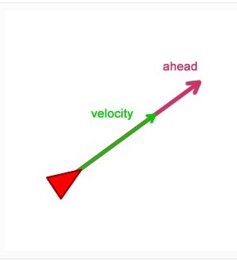
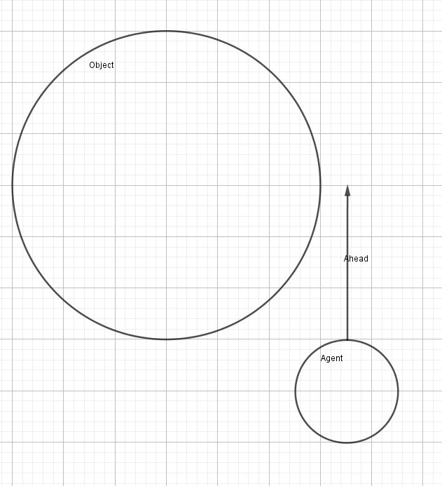
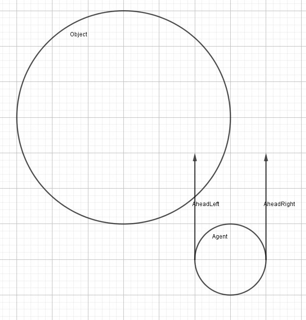
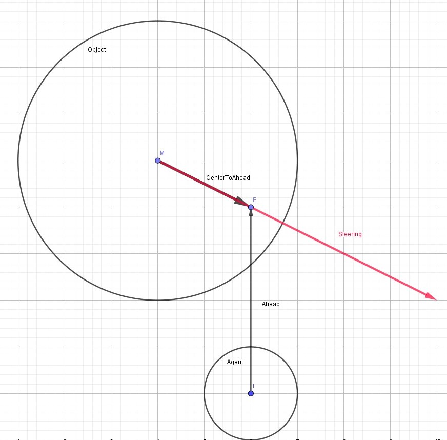
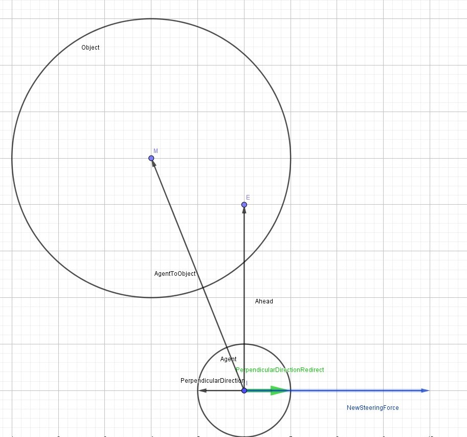
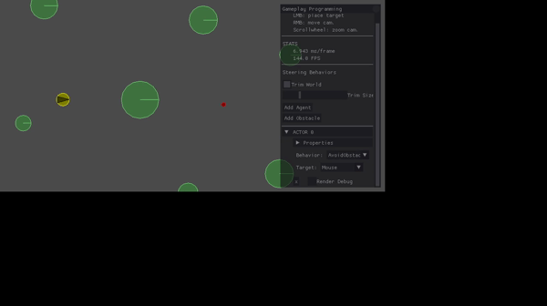

# Collision Avoidance
This repository is a project for an assignment given to me from the school I attend (DAE, Digital Arts & Entertainment, major Game Development), where I had to choose a research topic of my choice to implement on an AI.
In the courses we already saw Seeking, Face, Arrive, Fleeing, Wandering, Evade and Pursue as the basic behaviors for an AI. Collision avoidance is a useful one for future projects.

# Description
The function of collision avoidance is, like the name suggests, to avoid collision with an object that is in front of the AI. 
This object has to be the closest in order to work properly. To do this we need to see wat is all in front of us that has an influence. Then we have to calculate the force it needs to avoid the obstacle.
The last thing we have to keep in mind is that we need to know where the AI has to go to else this is just the flee steering behavior.
In order to do this, you need to have a point the AI has to go to, like the seek steering behavior.

# Design/Implementation
## Look for the possible collisions
The first thing is to know which object do we have to avoid.
For this I got two option.
1. Using an ahead vector explained by Fernando Bevilacqua [here](https://gamedevelopment.tutsplus.com/tutorials/understanding-steering-behaviors-collision-avoidance--gamedev-7777#:~:text=Introduction,to%20calculate%20the%20avoidance%20force.)  

2. Using a rectangle explained [here](https://www.red3d.com/cwr/steer/Obstacle.html)  

At first I tried using the first implementation, this uses a point to look for overlapping an object.
```
pointAhead = position + direction * maxAhead
```
The ```maxAhead``` defines how far the AI can see ahead.  
Just as explained in the arcticle, we get a problem when the object is closer then the ```maxAhead```.
We could solve this by getting a second or third point on the line.  

The problem I faced whas that the AI could not see the object when it was next to the points. 
  

Something that could be solved with the second solution. A simple rectangle is not hard to look for an overlapping, but we need to do a lot more to do this on a transformed rectangle. Which gave me an idea of a combined solution.  
The rectangle option gave me two ideas for the point based solution.
1. Instead of using multiple points, we can check if the line overlaps the object.
2. Having two lines, each on one side of the AI.  


```
Obstacle* AvoidObstacle::findObstacleToAvoid(Elite::Vector2 leftPos, Elite::Vector2 rightPos)
{
	Obstacle* pCloseObstacle = nullptr;
	float closestDistance = FLT_MAX, distance;
  
  //left ahead line
	Elite::Vector2 startPointLeft = pAgent->GetPosition() + leftpos;
	Elite::Vector2 endPointLeft = pAgent->GetPosition() + leftpos + (pAgent->GetDirection() * m_MaxAhead);

	//right ahead line
	Elite::Vector2 startPointRight = pAgent->GetPosition() + rightPos;
	Elite::Vector2 endPointRight = pAgent->GetPosition() + rightPos + (pAgent->GetDirection() * m_MaxAhead);
  
  
  for (Obstacle* pObstacle : *m_pObstacles)
	{
		//check left side
		if (IsCloser(pAgent, closestDistance, startPointLeft, endPointLeft, pObstacle))
		{
			pCloseObstacle = pObstacle;
			continue;
		}

		//if left failed, check right
		if (IsCloser(pAgent, closestDistance, startPointRight, endPointRight, pObstacle))
		{
			pCloseObstacle = pObstacle;
			continue;
		}
	}
  
	return pCloseObstacle;
}

bool AvoidObstacle::IsCloser(float& currentDistance, const Elite::Vector2& startPoint, const Elite::Vector2& endPoint, Obstacle* pObstacle)
{
	if (IsSegmentIntersectingWithCircle(startPoint, endPoint, pObstacle->GetCenter(), pObstacle->GetRadius()))
	{
		float distance = Distance(pAgent->GetPosition(), pObstacle->GetCenter());
		if (distance < currentDistance)
		{
			currentDistance = distance;
			return true;
		}
	}
	return false;
}
```
We first create or two lines. In order to get to the right point we need to know in wich direction they are.
```
leftPos = antiClockWise * direction * aiRadius;
rightPos = clockWise * direction * aiRadius;
```
Where ```antiClockWise``` and ```clockWise``` are rotation matrices for an angle of 90 degrees or Pi/2.  

The we look trough all obstacles and see which one intersects and is closer.
```
/*=============================================================================*/
// Copyright 2017-2018 Elite Engine
// Authors: Matthieu Delaere
/*=============================================================================*/
/*! Project point on line segment. If not on line, remap to fit on line segment (with or without extra offset)*/
	inline Vector2 ProjectOnLineSegment(const Vector2& segmentStart, const Vector2& segmentEnd, const Vector2& point, float offset = 0.0f)
	{
		//Shorten segment based on offset, before doing actual calculations
		auto toStartDirection = (segmentStart - segmentEnd).GetNormalized();
		auto vEnd = segmentEnd + (toStartDirection * offset);
		auto toEndDirection = (segmentEnd - segmentStart).GetNormalized();
		auto vStart = segmentStart + (toEndDirection * offset);
		//Create shorten segment
		auto line = vEnd - vStart;

		//Projection
		auto w = point - vStart;
		auto proj = Dot(w, line);
		auto offsetPercentage = offset / line.Magnitude();

		//Not on line or on vertex, get closest point and offset
		if (proj <= 0)
			return vStart;
		else
		{
			auto vsq = Dot(line, line);
			//Again not on line or on vertex, but the other side
			if (proj >= vsq)
				return vEnd;
			else
				return vStart + (proj / vsq) * line;
		}
	}

	inline bool IsSegmentIntersectingWithCircle(Vector2 startSegment, Vector2 endSegment, Vector2 circleCenter, float circleRadius)
	{
		Vector2 closestPoint = ProjectOnLineSegment(startSegment, endSegment, circleCenter);
		Vector2 distanceToCircleCenter = circleCenter - closestPoint;

		if (distanceToCircleCenter.MagnitudeSquared() <= (circleRadius * circleRadius))
		{
			return true;
		}

		return false;
	}
```
This code was already available by the school. It looks for the closest point the circle hits the line.  

Know we have found or closest object that is in sight.

## Avoidance Steering
In order to avoid the obstacle we need a vector that pushes the AI away of the object. Because we don't know wich of the two lines intersected, I created a third line, the same one as the first solution. By using the end point of the vector and the center of the object we create a vector, I used this vector as the steering.  
```
Elite::Vector2 aheadVector = direction * maxAhead;
steering = aheadVector - circleCenter;
normalize(steering);
steering *= maxAvoidForce;
```
The ```maxAvoidForce``` is like the name suggests the maximum force that will affect the AI's steering velocity.  


This does work to a certain extend, but is not practical, because the AI loses his momentum with the vector.  
To nullify this, we need the perpendicular of the current direction. which can be obtained by the ```antiClockWise``` or ```clockWise``` matrix and the current direction.
```
steering = antiClockWise * direction;
```
The result is that the AI avoid the obstacle without losing so much of his velocity. But now the AI only goes in one direction.
We can avoid this by looking if the center of the circle is on the left or right side of the AI. That is something that the cross product is able to tell us.

```
Elite::Vector2 aiToCenter = position - centerCircle;
float sign = Cross(aheadVector, aiToCenter);
```
If the result is negative the point is on the right side. If the result is positive the point is on the left side.
If we muliply this to or perpendicular of the direction, we can change his direction to the oposite and we end up with this result.
```
Elite::Vector2 AvoidObstacle::CalculateAvoidSteering()
{
	Elite::Vector2 steering, leftPos, rightPos;

	leftPos = antiClockWise * direction * aiRadius;
	rightPos = clockWise * direction * aiRadius;

	Obstacle* pObstacle = findObstacleToAvoid(pAgent, leftPos, rightPos);
	if (pObstacle != nullptr)
	{
		Elite::Vector2 aheadVector = direction * maxAhead;
		steering = antiClockWise * direction;
		Elite::Vector2 vectorToCenter = position - centerCirlce;
		float sign = Cross(aheadVector, vectorToCenter);
		steering *= sign;
		Elite::Normalize(steering);
		steering *= aiRadius * linearVelocity.Magnitude();
	}
	return steering;
}
```

With this we get a can avoid on the shortest path and or avoid works.

## The actual steering
We now have or avoidance steering, but we still need to add this to or seek steering behavior result. This is not so hard, we only need to calcualte the seek and the avoid and add these to or steering output, normalize it and multiply it with or maximum speed.
```
SteeringOutput AvoidObstacle::CalculateSteering(float deltaT)
{
	SteeringOutput steering;
	steering.LinearVelocity += Seek::CalculateSteering(deltaT).LinearVelocity;
	steering.LinearVelocity += CalculateAvoidSteering();
	steering.LinearVelocity.Normalize();
	steering.LinearVelocity *= maxLinearSpeed;

	return steering;
}
```

## Some optimizations
Now we have the basics of the collision avoid steering bhavior, but there are some things that can even be better.
1. Look ahead according to the AIs velocity.
We can achieve this by making a vector that has a value between 0 and 1 and multiply this to or ```maxAhead```.
```
float dynamicLength = linearVelocity.Magnitude() / MaxLinearSpeed;
Elite::Vector2 aheadVector = direction * dynamicLength * m_MaxAhead;
```
If the AI is slower, it is not needed to look very far.  

2. Change the avoidance force acording to the object.
Depending on the size of the object, we need to adjust or avoidance force.
On smaller objects it is not a real problem, but when the size becomes very large, if the force is not changed, we can still cause a collision because the AI will be faster then it can adjust his direction.
In order to do this, we can use the obstacles radius together with the current velocity of the AI.
```
steering *= radiusCircle * linearVelocity.Magnitude();
```
## Result
The result we see shows us the smooth movement to our seeked point.


## Conclusion / Future projects
A collision avoidance first sounds difficult, but once you understand how it works it is easy to alter where needed according to the needs of the project. The implementation shown here is good for static objects, but changes are needed if it has to be implemented for non-static objects or bots, because of the visibility.
